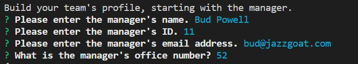
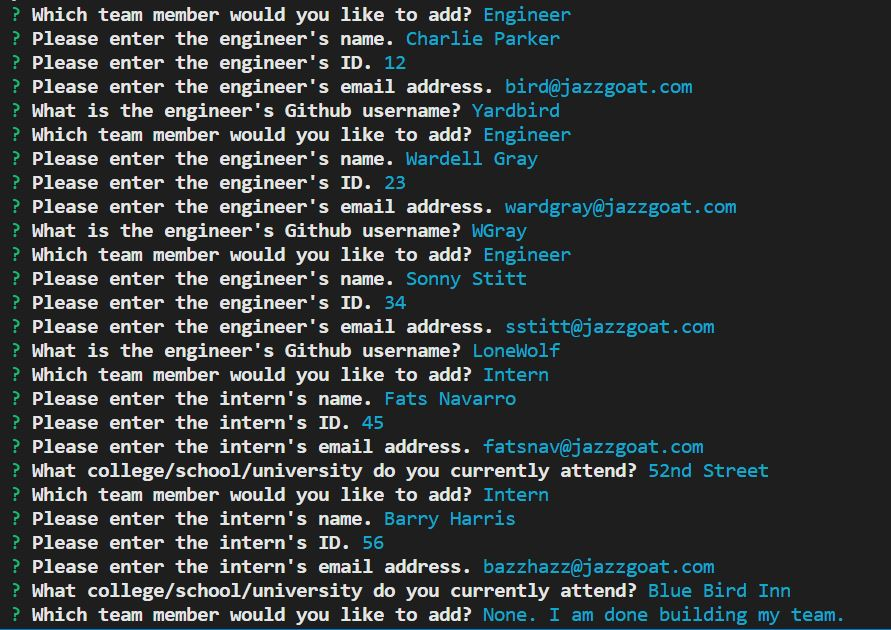
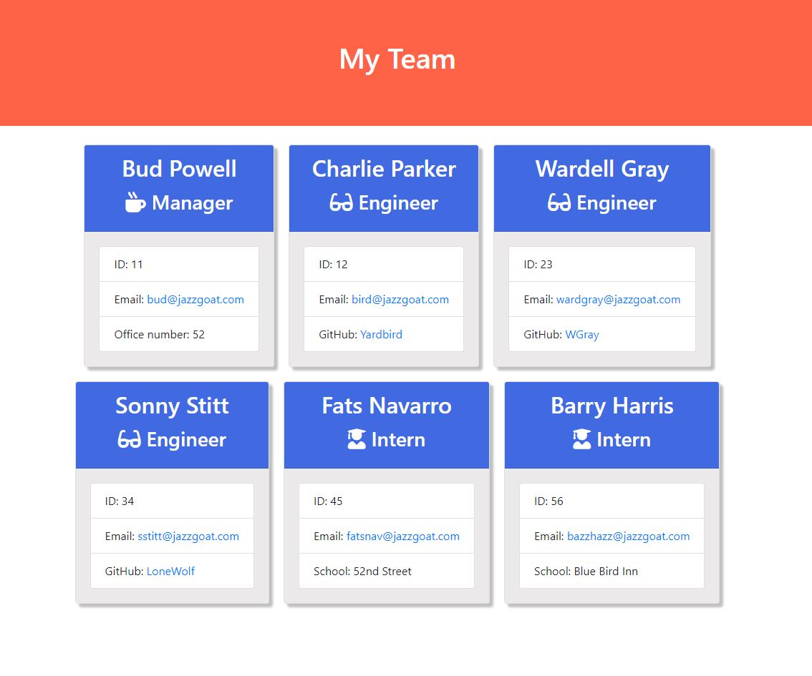
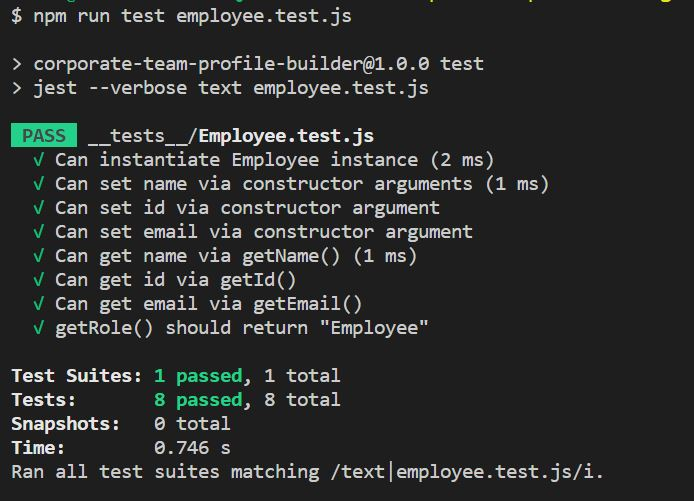
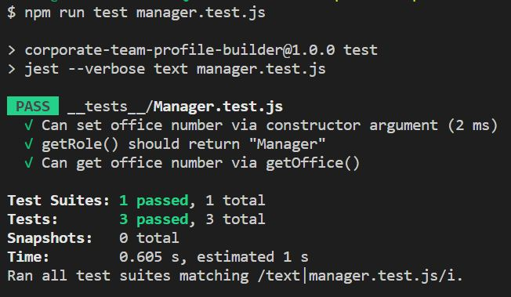
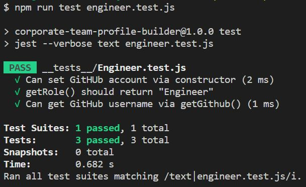
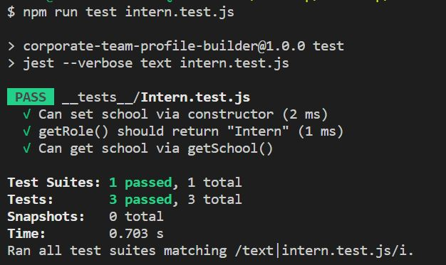

# Corporate Team Profile Builder App  

  
## Description  

This project is a Node.js command-line application that collects information about employees within a corporate team as user input, and dynamically generates an HTML webpage displaying summarised profiles for each employee. This could be particularly useful for a team leader or manager that would like to have ready access to team members' pertinent information. This application was built to run in Node.js, and makes use of Node Package Manager (npm), the inquirer software package for creating user prompts and collecting user inputs, and Jest for testing.    

## Table of Contents  

- [Description](#description)  
- [Installation](#installation)  
- [Usage](#usage)  
- [Credits](#credits)  
- [License](#license)  
- [Contributing](#contributing)  
- [Tests](#tests)  
- [Questions](#questions)

## Installation  

To use this application, you should have Node.js downloaded on your device. Copy the src and lib folders, which contain all the required .js files with the classes and HTML templates, along with the index.js file and assets folder and upload them to your desired web server. Also, initialise your repository with a `package.json` file by running `npm init -y`. Then install the inquirer package and ensure it is listed in your list of dependencies within the package.json file, by running `npm i inquirer --save`. Ensure the inquirer version in your package.json file is set to `^8.2.2` or higher. When you see the `node_modules` folder and `package-lock.json` file in your repo folder, then you have successfully installed everything you require to run the application.  

## Usage  

[Link to Project Code Repository](https://github.com/CcMong/corporate-team-profile-builder)  

  

When the program is run using the `node index.js` command, the user will be prompted for information that will be used to build the team starting with the manager.  

Once the manager profile has been created, the user will be prompted to add more team members. This will continue until the user indicates that the team profile is complete. Then HTML code will be rendered using the user input, and an HTML file will be created in an `output` folder.  

The HTML rendered from the team profile information will be displayed on a webpage as shown below:

  

## Credits  

N/A  

  

## License  

This project is covered under the MIT License. Please refer to the LICENSE documentation for further information.  

  

## Contributing  

Contributions, issues and feature requests are very much welcome. All contributions should be made in line with the [Contributor Covenant](https://www.contributor-covenant.org/).  

  

## Tests  

Unit tests were carried out using Jest, on all four files containing the classes used in the creation of the app. Details of the test carried out and the results are shown below:

    

  

## Questions  

Please feel free to reach out with any questions or feedback you might have. You can contact me through:  

* GitHub: [@CcMong](https://github.com/CcMong)

